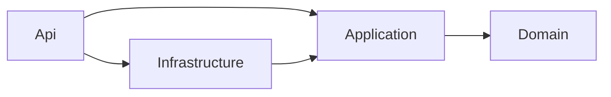

# PapirFly

REST API for registering and retrieving shop articles, based on [NET Developer.pdf](NET%20Developer.pdf).
The solution uses .NET 10, ASP.NET Core controllers, EF Core InMemory or PostgreSQL, Mapster, Serilog,
and Alba + xUnit tests with optional PostgreSQL Testcontainers.

> **A running local Docker installation is required for the PostgreSQL setup below and for PostgreSQL
> integration tests. Start Docker Desktop in Linux container mode, or a compatible Docker Engine, before
> selecting PostgreSql. The default InMemory mode requires no Docker.**

## Getting started

Install the .NET 10 SDK. `global.json` allows the latest installed feature band within SDK version 10.0.
All committed configurations default to InMemory, so the following commands need no database server,
Docker installation, or credentials.

```sh
dotnet restore PapirFly.sln --locked-mode
dotnet build PapirFly.sln --configuration Release --no-restore
dotnet run --project src/PapirFly.Api --configuration Release --no-build --urls http://localhost:5000
```

- Swagger UI: <http://localhost:5000/swagger/index.html>
- OpenAPI document: <http://localhost:5000/swagger/v1/swagger.json>
- Articles API: <http://localhost:5000/api/articles>

Requests within the same application instance share their data. InMemory data is lost when the host stops;
PostgreSQL data persists in the configured database across application restarts.

## Environment and storage configuration

The API loads `appsettings.json`, then `appsettings.{Environment}.json`, then environment and command-line
overrides. Environment files live in `src/PapirFly.Api`:

| File | Purpose | Default storage |
| --- | --- | --- |
| `appsettings.json` | Common settings, console logging and storage fallback | `InMemory` |
| `appsettings.Development.json` | Local development and debug application logging | `InMemory` |
| `appsettings.Production.json` | Production settings and information-level logging | `InMemory` |
| `appsettings.Testing.json` | Integration test defaults and Testcontainers image | `InMemory` |

Every file contains a **commented PostgreSQL alternative** next to its active InMemory section. ASP.NET
Core's configuration reader supports these JSON comments. To use the alternative, replace the active
`Storage` section; do not leave two active sections with the same key. Environment overrides let you
switch providers without editing any files.

`Storage:Provider` accepts `InMemory` or `PostgreSql`. PostgreSQL also requires `Storage:ConnectionString`.
Unknown providers and missing PostgreSQL connection strings fail validation instead of silently selecting
another store. Keep actual production credentials in deployment configuration rather than committed files.

### Local PostgreSQL

Start the database with a persistent Docker volume:

```sh
docker run --detach --name papirfly-postgres --publish 5432:5432 --env POSTGRES_DB=papirfly --env POSTGRES_USER=papirfly --env POSTGRES_PASSWORD=papirfly_dev --volume papirfly-postgres-data:/var/lib/postgresql/data postgres:17-alpine
```

Then start the API with PostgreSQL (PowerShell):

```powershell
$env:DOTNET_ENVIRONMENT = 'Development'
$env:Storage__Provider = 'PostgreSql'
$env:Storage__ConnectionString = 'Host=localhost;Port=5432;Database=papirfly;Username=papirfly;Password=papirfly_dev'
dotnet run --project src/PapirFly.Api --configuration Release --no-launch-profile --urls http://localhost:5000
```

`--no-launch-profile` allows the selected environment and URL to take precedence over local launch settings.
After stopping the API, remove the `Storage__Provider` and `Storage__ConnectionString` environment variables
to return to the committed InMemory defaults. For an existing database container, use
`docker start papirfly-postgres` instead of creating it again.

The API applies the committed EF Core migrations at startup; it does not recreate or delete the database.
The configured account must therefore be able to apply schema changes. Schema and migration history live
in PostgreSQL, and reapplying initialization after a host restart is safe. Future schema changes should be
added as migrations in `PapirFly.Infrastructure/Persistence/Migrations`.

The local Docker requirement applies to this local setup and Testcontainers. An application can also connect
to an already running remote PostgreSQL server by changing the connection string; its host does not need Docker.

## Solution design

```text
src/
  PapirFly.Domain/            Article entity, field limits, ISO currency codes
  PapirFly.Application/
    Articles/                Use case handlers, shared validation and exceptions
      Commands/              One command per file
      Queries/               One query per file
    DTOs/                    ArticleInput and ArticleResponse
    Interfaces/              IArticleRepository
  PapirFly.Infrastructure/    Storage options, EF Core context, repository and PostgreSQL migrations
  PapirFly.Api/               JSON, Problem Details, Serilog, Swagger and DI configuration
    Controllers/             ArticlesController and its HTTP actions
tests/
  PapirFly.UnitTests/         Validation rules and boundary cases
  PapirFly.IntegrationTests/  Full HTTP pipeline, persistence, OpenAPI and logging
```

### Clean Architecture

Project dependencies point towards the application and domain:



`Domain` has no project or package dependencies. `Application` does not depend on HTTP, ASP.NET Core,
EF Core, or a particular database. It uses `IArticleRepository`, which `Infrastructure` implements.
`Api` is the composition root: it registers implementations and translates HTTP requests into handler calls.
Its infrastructure reference is used for registration; the controller does not access the context.

The domain has one simple entity. Additional aggregate hierarchies, domain events, and service layers
are unnecessary for its current behavior.

DTOs live in `PapirFly.Application.DTOs`; persistence interfaces live in `PapirFly.Application.Interfaces`.
Command and query models have separate `PapirFly.Application.Articles.Commands` and
`PapirFly.Application.Articles.Queries` namespaces. Each command and query has its own file named after
the type. Handlers remain in `PapirFly.Application.Articles`.

### CQRS

Reads and writes have separate models and handlers:

| Operation | Model | Handler |
| --- | --- | --- |
| Create one article | `CreateArticleCommand` | `CreateArticleHandler` |
| Create a batch concurrently | `CreateArticlesCommand` | `CreateArticlesHandler` |
| Update an article | `UpdateArticleCommand` | `UpdateArticleHandler` |
| Read by ID | `GetArticleQuery` | `GetArticleHandler` |
| Search | `FindArticlesQuery` | `FindArticlesHandler` |

Create and update commands also serve as the write request contracts. The update ID is supplied
separately from the route. Queries read detached entities with `AsNoTracking` and return
`ArticleResponse` objects. Commands validate their inputs, write through the repository, and return
the stored representation.

CQRS separates responsibilities over a single store; it does not require separate databases or event
sourcing. The controller receives concrete handlers through constructor injection. No mediator,
reflection-based dispatcher, or generic request/response hierarchy is needed.

### Controller and HTTP boundary

`ArticlesController` derives from `ControllerBase` and uses `[ApiController]` with attribute routing.
Its five actions delegate to the application handlers and return `ActionResult<ArticleResponse>` or
`ActionResult<ArticleResponse[]>`. The batch action keeps the assignment's `/api/articles-concurrent` route.

MVC handles JSON deserialization and malformed-body errors. Shared application validation continues
to enforce the article rules. `ApiExceptionHandler` translates application validation, missing-article,
and concurrency failures into Problem Details responses. JSON settings belong to `AddControllers().AddJsonOptions`,
which also supplies the naming configuration used by Swagger.

### Repository pattern and configurable EF Core storage

`IArticleRepository` exposes only operations needed by article use cases. It does not expose
`IQueryable`, `DbSet`, or `DbContext`. `ArticleRepository` implements both searches and writes; an additional
generic CRUD repository or Unit of Work wrapper would duplicate the existing EF Core responsibilities.

`IDbContextFactory<ArticlesDbContext>` creates a short-lived context for each operation. `StorageOptions`
is bound and validated through DI. The same repository uses either EF Core InMemory or the Npgsql provider,
selected when the context factory resolves its options. The application and domain layers are unchanged.

InMemory contexts within one host share an `InMemoryDatabaseRoot`; different hosts have separate stores.
PostgreSQL contexts connect to the configured SQL database. Concurrent operations never share a context.
The initial migration creates the article table, generated integer IDs, field lengths, numeric prices,
and UUID version values. The existing EF concurrency-token check works with both providers.

Name search uses ordinal case-insensitive `Contains` with InMemory and server-side `ILIKE` with PostgreSQL.
PostgreSQL patterns escape `%`, `_`, and backslash so those characters remain literal user input.
PostgreSQL case folding follows the database locale. Category matching remains an exact, case-sensitive match.

### Mapster and shared rules

Mapster maps input commands to `Article` and entities to `ArticleResponse`. Its configuration belongs
to the host and is compiled at startup. Input maps inherit the common `ArticleInput -> Article` mapping,
which ignores the server-managed ID and version. Updates map onto the loaded entity, including clearing
omitted optional fields.

`ArticleInput` shares the editable fields. `ArticleValidator` shares validation between single creates,
batches, and updates. Field length limits are declared once in the domain and reused by validation and
EF configuration. `ArticleResponse` is the output contract; entities are not returned directly over HTTP.

## API contract

| Method and route | Behavior | Responses |
| --- | --- | --- |
| `POST /api/articles` | Creates an article with a generated ID and version | `200`, `400` |
| `GET /api/articles/{articleId}` | Retrieves an article by ID | `200`, `404` |
| `GET /api/articles?name=...&category=...` | Searches for articles | `200`, including `[]` |
| `POST /api/articles-concurrent` | Stores an array of articles concurrently | `200`, `400` |
| `PUT /api/articles/{articleId}` | Replaces an article with a version check | `200`, `400`, `404`, `409` |

Creation returns `200 OK` to match the assignment. Errors use Problem Details; validation errors include
an `errors` dictionary. Unsupported request content types return `415`.

### Validation

| Field | Rule |
| --- | --- |
| `article_id` | Positive server-generated integer; must not be present in the request, even as `null` |
| `name` | Required, nonblank string of at most 64 characters |
| `description` | Required, nonblank string of at most 2048 characters |
| `category` | Optional string of at most 64 characters |
| `price` | Required JSON number `>= 0`, stored as `decimal`; numeric strings are rejected |
| `currency` | Uppercase ISO 4217 code; required for a positive price and may be blank when the price is zero |
| `version` | Server-generated UUID; the last read version is required for PUT and forbidden for POST |

Unknown JSON properties are rejected. Missing optional values are omitted from responses. A blank currency
for a free article is normalized to `null`; a nonblank currency is validated even when the price is zero.
The currency list is a snapshot of [SIX's official ISO 4217 List One](https://www.six-group.com/dam/download/financial-information/data-center/iso-currrency/lists/list-one.xml)
published on September 17, 2026. Update `CurrencyCodes.cs` when refreshing it. Runtime validation does not
rely on network access or platform-specific locale data.

The PDF's PUT example shows a numeric string, but its contract and validation example require a number.
The implementation consistently requires a JSON number for updates as well as creation.

### Search

- `name` matches a substring case-insensitively; SQL wildcard characters are treated literally.
- `category` matches the whole value, case-sensitively; the assignment only requires case-insensitive name matching.
- Supplied filters are combined with AND. Without filters, the API returns all articles ordered by ID.
- URL-encode values, for example `?name=branded&category=USB%20flash%20drive`.

### Concurrent insertion

The batch handler validates all articles before starting any writes. An invalid batch is rejected without
persisting any of its articles. Error keys include the item index, for example `[1].currency`. An empty
batch returns `[]`; a null item is invalid.

After validation, `Parallel.ForEachAsync` runs at most four writers, each with its own context. EF generates
the IDs. Responses preserve input order even if IDs are assigned in a different order. Cancellation is
propagated to outstanding operations. The no-writes guarantee applies to invalid input; storage failure or
cancellation during a valid batch may leave partial writes. Both providers commit each article separately;
the concurrent batch is not wrapped in a shared transaction.

### Optimistic concurrency

1. The client reads an article and keeps its `version`.
2. A PUT request sends the complete replacement values and that version.
3. The handler validates the input and checks the loaded version. A missing ID returns `404`; a stale version returns `409`.
4. The repository sets EF's expected original version and generates a new version for the update.
5. `Version` is an EF concurrency token, so it is checked again when saving. This also protects the race
   between reading and writing. `DbUpdateConcurrencyException` becomes an application conflict and HTTP `409`.

After a conflict, the client must reload the article and decide how to reconcile its changes.

### Example

Send `POST /api/articles` with `Content-Type: application/json`:

```json
{
  "name": "Branded Memory Stick",
  "description": "Branded 16 GB memory stick",
  "category": "USB flash drive",
  "price": 17.89,
  "currency": "NOK"
}
```

Example `200 OK` response (the ID and UUID are illustrative):

```json
{
  "article_id": 1,
  "name": "Branded Memory Stick",
  "description": "Branded 16 GB memory stick",
  "category": "USB flash drive",
  "price": 17.89,
  "currency": "NOK",
  "version": "6893eac5-9bd1-4aa1-97f7-51c0d5d93d83"
}
```

For `PUT /api/articles/1`, send the editable fields and the `version` from the last response; leave
`article_id` in the URL only. Successful updates return a new version. The batch endpoint accepts an
array of create request objects and returns an array of `ArticleResponse` objects.

## XML documentation and Swagger

Public types and members, including methods in the test projects, have XML documentation. Method comments
describe behavior, parameters, return values, and relevant failures. Repository implementations reuse
the interface documentation through `<inheritdoc />`.

`GenerateDocumentationFile` is enabled solution-wide. The existing warnings-as-errors setting makes
missing public XML documentation (`CS1591`) fail the build. Generated XML files are placed beside the
assemblies. Swagger loads the API and application XML files to document controller actions and DTO properties.
Controller summaries, remarks, parameters, and response descriptions therefore come from the same comments
used by IDE tooling. The OpenAPI response schema is named `ArticleResponse`.

## Logging with Serilog

`Serilog.AspNetCore` handles application and ASP.NET Core logs. Services can use the standard injected
`ILogger<T>`. Configuration is read from the `Serilog` section of the common and environment-specific appsettings files:

- JSON events are written to the console with an `Application: PapirFly.Api` property.
- The default minimum level is `Information`, overridden to `Debug` in Development; ASP.NET Core and EF Core
  sources are limited to `Warning`. Testing additionally suppresses information-level host lifetime events.
- `UseSerilogRequestLogging` records the HTTP method, request path, final response status, and elapsed time.
- The logger is owned by its application host and disposed with it. Request logging explicitly uses the
  same DI logger, so parallel test hosts do not interfere through a global static logger.
- `ReadFrom.Services` supports registered Serilog sinks, including the capturing sink used in integration tests.

The request logger wraps exception handling so it records the final status for handled failures.
Log levels can be overridden through configuration, for example `Serilog__MinimumLevel__Default=Debug`.

## Testing

```sh
# All tests with the committed InMemory defaults (no Docker required)
dotnet test PapirFly.sln --configuration Release

# Integration tests only, using the configured provider
dotnet test tests/PapirFly.IntegrationTests --configuration Release
```

### PostgreSQL integration tests

**Docker must be running locally.** You do not need to start the development database above: Testcontainers
creates its own PostgreSQL containers, random host ports, generated credentials, and isolated databases.

Select PostgreSQL without editing the default configuration (PowerShell):

```powershell
$env:PAPIRFLY_TEST_Storage__Provider = 'PostgreSql'
dotnet test tests/PapirFly.IntegrationTests --configuration Release
Remove-Item Env:PAPIRFLY_TEST_Storage__Provider
```

On Bash:

```sh
PAPIRFLY_TEST_Storage__Provider=PostgreSql dotnet test tests/PapirFly.IntegrationTests --configuration Release
```

Set the same override to `InMemory` to explicitly run without Docker, or switch `Storage:Provider` in
`appsettings.Testing.json` using its commented example. Removing the override restores the file's selection.
`Testcontainers:PostgresImage` selects the image, currently `postgres:17-alpine`; it can also be overridden
as `PAPIRFLY_TEST_Testcontainers__PostgresImage`. The first SQL run may need to download Docker images.

`ApiFixture` loads `appsettings.Testing.json` plus environment variables prefixed with `PAPIRFLY_TEST_`.
Every Alba host runs in the `Testing` environment. In PostgreSQL mode, the fixture starts a container and
uses `ConfigureTestServices` with `PostConfigure<StorageOptions>` to inject its connection string before
the context factory is resolved. InMemory mode overrides the same DI options without starting a container.
Test cleanup never uses a configured development or production connection string. A requested PostgreSQL
run fails if Docker is unavailable; it does not silently fall back or skip SQL tests.

Alba exercises the same controller pipeline, DI, validation, Mapster and repository with either provider.
TestServer is the in-memory HTTP host; PostgreSQL is still a real SQL server in its container. A fixture
shares its host and, in SQL mode, its container within a test class. Other fixtures have isolated stores.
Before each article test, PostgreSQL rows are deleted without dropping the schema or migration history;
InMemory storage is cleared. Fixture disposal shuts down the host and removes its container. A restart
scenario retains the SQL container to verify that articles survive restarting the API.

Coverage includes all five article operations, invalid JSON, validation boundaries, search and literal SQL
metacharacters, batch validation before writes, concurrent creates, update conflicts, store isolation,
the actual selected EF provider, migrations, PostgreSQL durability, OpenAPI descriptions, Swagger UI and
structured Serilog events. Detached-snapshot tests exercise concurrency enforcement at save time.
Configuration tests verify all environment defaults, SQL registration and invalid configuration rejection.
Unit tests cover validation rules and boundary values.

## GitHub Actions

[`.github/workflows/build.yml`](.github/workflows/build.yml) runs on pushes, pull requests, and manual dispatch.
It uses an Ubuntu matrix with **InMemory and PostgreSql** jobs. Each job:

1. Installs .NET 10 and restores the NuGet cache.
2. Runs `dotnet restore --locked-mode` against the committed `packages.lock.json` files.
3. Builds the solution in Release mode with compiler warnings treated as errors, including missing XML documentation.
4. Runs unit tests and the full Alba integration suite with `PAPIRFLY_TEST_Storage__Provider` set to its matrix
   provider. The SQL job uses the runner's Docker daemon and disposable Testcontainers. A test failure fails the job.
5. Publishes a visual test report in the run's **Summary**, separately for each storage provider.
6. Uploads available TRX results as `test-results-InMemory` or `test-results-PostgreSql`, including on test failure,
   with 14-day retention.

### Viewing test results

Open [Actions → Build and test](https://github.com/cernydgit/Papirfly/actions/workflows/build.yml), select a run,
and open **Summary**. The **Tests (InMemory)** and **Tests (PostgreSql)** reports show passed, failed and skipped
counts, execution times, and expandable suites and individual test results. Successful report details are
collapsed by default; failed reports expand automatically. `unit.trx` and `integration.trx` identify the two
test suites. Failure details include the captured error messages and stack traces.

Reports are generated from the existing TRX files using [Test Reporter](https://github.com/dorny/test-reporter).
After a successful build, integration tests and reporting run even if unit tests fail; failures still fail
the job. If the build fails before tests can run, there is no test report. Raw logs remain available under
the **Unit tests** and **Alba integration tests** steps, and TRX downloads remain in **Artifacts**.

Package versions are centralized in `Directory.Packages.props`. After changing dependencies, run
`dotnet restore` and include the updated lock files with the change. CI needs no separately provisioned
database or custom secrets; the PostgreSQL job requires Docker, available on GitHub-hosted Ubuntu runners.
The workflow requests only `contents: read` permission.

## References

- [Alba: HTTP integration scenarios](https://jasperfx.github.io/alba/guide/gettingstarted.html)
- [Mapster: mapping configuration](https://github.com/MapsterMapper/Mapster/wiki/Configuration)
- [EF Core: optimistic concurrency](https://learn.microsoft.com/en-us/ef/core/saving/concurrency)
- [Npgsql: SQL query translations](https://www.npgsql.org/efcore/mapping/translations.html)
- [Testcontainers: PostgreSQL module](https://dotnet.testcontainers.org/modules/postgres/)
- [ASP.NET Core: controller-based web APIs](https://learn.microsoft.com/en-us/aspnet/core/web-api/?view=aspnetcore-10.0)
- [Serilog: ASP.NET Core integration](https://github.com/serilog/serilog-aspnetcore)
- [GitHub Actions: building and testing .NET](https://docs.github.com/en/actions/tutorials/build-and-test-code/net)
