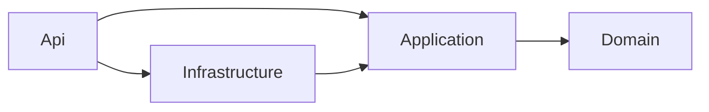

# PapirFly

REST API pro evidenci a vyhledávání obchodních artiklů podle zadání [NET Developer.pdf](NET%20Developer.pdf).
Řešení používá .NET 10, ASP.NET Core Minimal APIs, EF Core InMemory, Mapster a integrační testy Alba + xUnit.

## Spuštění

Je potřeba .NET 10 SDK. `global.json` dovoluje aktuální feature verzi SDK řady 10.0.
Není potřeba databázový server, Docker ani přístupové údaje.

```sh
dotnet restore PapirFly.sln --locked-mode
dotnet build PapirFly.sln --configuration Release --no-restore
dotnet run --project src/PapirFly.Api --configuration Release --no-build --urls http://localhost:5000
```

- Swagger UI: <http://localhost:5000/swagger/index.html>
- OpenAPI: <http://localhost:5000/swagger/v1/swagger.json>
- API: <http://localhost:5000/api/articles>

Data jsou společná pro všechny požadavky jedné instance aplikace a po jejím ukončení se ztratí.

## Design a závislosti

```text
src/
  PapirFly.Domain/          Entita Article, limity polí, číselník měn
  PapirFly.Application/     Commands, queries, handlery, DTO, validace, repository rozhraní, Mapster
  PapirFly.Infrastructure/  EF Core DbContext a implementace repository
  PapirFly.Api/             HTTP endpointy, JSON kontrakt, Problem Details, Swagger, sestavení DI
tests/
  PapirFly.UnitTests/       Izolované testy validačních pravidel
  PapirFly.IntegrationTests/ Celá HTTP pipeline přes Alba a skutečné EF Core InMemory úložiště
```

### Clean Architecture

Závislosti projektů směřují k aplikačnímu a doménovému jádru:



`Domain` neodkazuje na žádný jiný projekt ani externí balíček. `Application` nezná HTTP, ASP.NET Core,
EF Core ani konkrétní databázi. Pracuje s rozhraním `IArticleRepository`. `Infrastructure` toto rozhraní
implementuje. `Api` skládá implementace v dependency injection a převádí HTTP požadavky na volání handlerů.
Reference API na infrastrukturu slouží k její registraci při startu; endpointy s DbContextem nepracují.

Doména tohoto zadání má jednu jednoduchou entitu. Samostatné agregáty, doménové události ani další servisní
vrstvy by nepřidaly potřebné chování, proto zde nejsou.

### CQRS

Zápisy a čtení mají oddělené modely a handlery:

| Operace | Model a handler |
| --- | --- |
| Vytvoření artiklu | `CreateArticleCommand`, `CreateArticleHandler` |
| Souběžné vytvoření dávky | `CreateArticlesCommand`, `CreateArticlesHandler` |
| Aktualizace | `UpdateArticleCommand`, `UpdateArticleHandler` |
| Načtení podle ID | `GetArticleQuery`, `GetArticleHandler` |
| Vyhledávání | `FindArticlesQuery`, `FindArticlesHandler` |

Command DTO jsou zároveň vstupním kontraktem zápisových endpointů. ID aktualizovaného artiklu se předává
handleru odděleně z URL. Queries pouze čtou, používají `AsNoTracking` a vracejí DTO. Commands validují
vstup, mění stav přes repository a vracejí uloženou podobu artiklu.

CQRS zde odděluje odpovědnosti nad jedním úložištěm; nevyžaduje oddělené databáze ani event sourcing.
Endpointy injektují konkrétní handlery přímo, takže není potřeba mediator, reflexní dispatcher ani
generická hierarchie request/response tříd. Model a jeho handler jsou společně v souboru dané operace.

### Repository pattern a EF Core InMemory

`IArticleRepository` definuje pouze operace, které artikly potřebují. Nevystavuje `IQueryable`,
`DbSet` ani `DbContext` mimo infrastrukturu. `ArticleRepository` implementuje vyhledávání i zápisy;
samostatný generický CRUD repository nebo Unit of Work obal by zde duplikoval EF Core.

`IDbContextFactory<ArticlesDbContext>` vytváří krátkodobý context pro každou operaci. Všechny contexty
jednoho aplikačního hostu sdílejí jeden `InMemoryDatabaseRoot`. Různé hosty mají oddělené databáze,
což zároveň zajišťuje izolaci testů. Context se nesdílí mezi souběžnými operacemi.

Požadované InMemory úložiště je záměrně jediné nakonfigurované úložiště. Volitelný SQL úkol z PDF je
tím nahrazen. InMemory není relační databáze, nemá trvalost mezi spuštěními ani transakce pro dávku.
Při případném doplnění SQL provideru je potřeba upravit registraci, migrace a ověřit překlad filtrů:
aktuální `Contains(..., StringComparison.OrdinalIgnoreCase)` využívá možnosti InMemory provideru.

### Mapster a sdílení pravidel

Mapster zajišťuje oba směry mapování: vstupní command DTO na `Article` a `Article` na `ArticleDto`.
Konfigurace je lokální pro aplikační host a kompiluje se při startu. Vstupní mapy dědí jednu konfiguraci
`ArticleInput -> Article`; ID a verze se při mapování ignorují, protože je spravuje server.
Update mapuje do načtené entity, včetně vymazání vynechaných volitelných polí.

`ArticleInput` sdílí pole pro vytvoření a aktualizaci. `ArticleValidator` sdílí pravidla mezi vytvořením,
dávkou a aktualizací. Maximální délky jsou definované jednou v doméně a využívá je i EF konfigurace.
JSON nastavení používá stejnou funkci pro runtime a Swagger, aby dokumentace odpovídala skutečným názvům polí.

## API kontrakt

| Metoda a cesta | Chování | Odpovědi |
| --- | --- | --- |
| `POST /api/articles` | Vytvoří artikl a přidělí ID a verzi | `200`, `400` |
| `GET /api/articles/{articleId}` | Načte artikl podle ID | `200`, `404` |
| `GET /api/articles?name=...&category=...` | Vyhledá artikly | `200`, včetně `[]` |
| `POST /api/articles-concurrent` | Souběžně uloží pole artiklů | `200`, `400` |
| `PUT /api/articles/{articleId}` | Nahradí artikl s kontrolou verze | `200`, `400`, `404`, `409` |

Vytvoření vrací `200 OK` podle PDF. Chyby používají standardní Problem Details;
validační chyby navíc obsahují slovník `errors` podle názvů polí. Nepodporovaný Content-Type vrací `415`.

### Validace

| Pole | Pravidlo |
| --- | --- |
| `article_id` | Generované kladné celé číslo; nesmí být ve vstupním JSON, ani jako `null` |
| `name` | Povinný neprázdný řetězec, nejvýše 64 znaků |
| `description` | Povinný neprázdný řetězec, nejvýše 2048 znaků |
| `category` | Volitelné, nejvýše 64 znaků |
| `price` | Povinné JSON číslo `>= 0`, interně `decimal`; číselný řetězec se odmítá |
| `currency` | ISO 4217 kód velkými písmeny; při kladné ceně povinný, při nule smí být prázdný |
| `version` | Serverem generované UUID v odpovědi; při PUT povinná poslední načtená verze, při POST zakázané |

Neznámá JSON pole se odmítají. Neuvedené volitelné hodnoty se v odpovědi vynechají. Prázdná měna
bezplatného artiklu se normalizuje na `null`. Uvedená neprázdná měna se ověřuje i při nulové ceně.
Číselník je snapshot [oficiálního ISO 4217 List One od SIX](https://www.six-group.com/dam/download/financial-information/data-center/iso-currrency/lists/list-one.xml)
z 17. září 2026 a aktualizuje se v `CurrencyCodes.cs`; běh aplikace nevyžaduje síť ani lokální číselníky OS.

PDF má v příkladu PUT cenu uvedenou jako řetězec, ale jeho kontrakt a validační příklad vyžadují číslo.
Implementace proto konzistentně požaduje JSON číslo i při aktualizaci.

### Vyhledávání

- `name`: částečná shoda bez rozlišení velikosti písmen, s ordinal porovnáním.
- `category`: úplná shoda s rozlišením velikosti písmen; PDF u kategorie nepožaduje case-insensitive hledání.
- Oba filtry se kombinují pomocí AND. Bez filtrů se vrací všechny artikly seřazené podle ID.
- Hodnoty se URL kódují, např. `?name=branded&category=USB%20flash%20drive`.

### Souběžné vkládání

Dávkový command nejprve ověří všechny položky. Pokud některá nevyhovuje, neuloží se žádná a chyby
obsahují index položky, např. `[1].currency`. Prázdná dávka vrací `[]`; `null` položka je neplatná.

Po validaci repository použije `Parallel.ForEachAsync` s nejvýše čtyřmi zapisujícími operacemi,
každou s vlastním contextem. ID generuje EF Core. Odpověď zachová pořadí vstupu, i když přidělená ID
mohou být kvůli souběhu v jiném pořadí. Zrušení požadavku se propaguje přes cancellation token.
Garance „žádné zápisy“ platí pro neplatný vstup; při chybě úložiště nebo zrušení již probíhající validní
dávky mohou zůstat částečné zápisy, protože InMemory provider nemá dávkovou transakci.

### Optimistická konkurence při aktualizaci

1. Klient načte artikl a uchová jeho `version`.
2. Při PUT pošle celé nové hodnoty a tuto verzi.
3. Handler ověří vstup a porovná verzi s načteným stavem. Neexistující ID vrací `404`, stará verze `409`.
4. Repository při ukládání nastaví očekávanou původní verzi v EF a vygeneruje novou.
5. `Version` je EF concurrency token, takže kontrola proběhne také při zápisu. Chrání i závod mezi
   načtením a uložením. `DbUpdateConcurrencyException` se převádí na aplikační konflikt a HTTP `409`.

Po konfliktu musí klient znovu načíst aktuální data a rozhodnout, jak změny sloučit.

### Příklad

`POST /api/articles` s `Content-Type: application/json`:

```json
{
  "name": "Branded Memory Stick",
  "description": "Branded 16 GB memory stick",
  "category": "USB flash drive",
  "price": 17.89,
  "currency": "NOK"
}
```

Odpověď `200 OK` (ID a UUID jsou ilustrační):

```json
{
  "article_id": 1,
  "name": "Branded Memory Stick",
  "description": "Branded 16 GB memory stick",
  "category": "USB flash drive",
  "price": 17.89,
  "currency": "NOK",
  "version": "6893eac5-9bd1-4aa1-97f7-51c0d5d93d83"
}
```

Pro `PUT /api/articles/1` pošlete vstupní pole s novými hodnotami a `version` z poslední odpovědi;
`article_id` zůstává pouze v URL. Úspěšná odpověď obsahuje novou verzi. Dávkový endpoint přijímá pole
stejných objektů jako POST a vrací pole uložených artiklů.

## Testování

```sh
# Všechny testy
dotnet test PapirFly.sln --configuration Release

# Pouze integrační testy
dotnet test tests/PapirFly.IntegrationTests --configuration Release
```

Alba spouští skutečnou ASP.NET Core pipeline přes TestServer v paměti. Testy používají reálnou konfiguraci
DI, validaci, Mapster i EF Core repository, bez mockování databáze nebo handlerů. JSON scénáře ověřují
skutečný HTTP kontrakt, včetně názvu `article_id`, typů hodnot a statusů.

Host se sdílí v rámci testovací třídy; úložiště se před každým článkovým testem vyčistí. Třídy mají
samostatné hosty, takže se navzájem neovlivňují. Pokrytí zahrnuje všechny endpointy, neplatné JSON a
validační hranice, filtry a URL kódování, validaci celé dávky před zápisem, souběžná vytváření,
konflikty aktualizací, izolaci hostů, Swagger JSON i UI. Samostatný test dvou odpojených EF snapshotů
ověřuje kontrolu concurrency tokenu při uložení, nezávisle na předběžné kontrole v handleru.

Unit testy samostatně ověřují validační pravidla a mezní hodnoty.

## GitHub Actions

Workflow [`.github/workflows/build.yml`](.github/workflows/build.yml) se spouští při pushi,
pull requestu a ručně. Na Ubuntu provede:

1. Instalaci .NET 10 SDK a obnovení NuGet cache.
2. `dotnet restore --locked-mode` nad verzovanými `packages.lock.json`.
3. Release build celého řešení; varování kompilátoru se považují za chyby.
4. Unit testy a poté všechny integrační testy Alba. Selhání testu způsobí selhání buildu.
5. Nahrání dostupných TRX výsledků jako artefakt `test-results` i při selhání testů, s uchováním 14 dní.

Verze závislostí jsou společné v `Directory.Packages.props`. Po změně verzí spusťte běžné
`dotnet restore` a zahrňte aktualizované lock soubory do stejné změny. Workflow nepotřebuje databázovou
službu ani vlastní secrets a používá pouze oprávnění `contents: read`.

## Odkazy

- [Alba: integrační HTTP scénáře](https://jasperfx.github.io/alba/guide/gettingstarted.html)
- [Mapster: konfigurace mapování](https://github.com/MapsterMapper/Mapster/wiki/Configuration)
- [EF Core: optimistická konkurence](https://learn.microsoft.com/en-us/ef/core/saving/concurrency)
- [GitHub Actions: build a testování .NET](https://docs.github.com/en/actions/tutorials/build-and-test-code/net)
